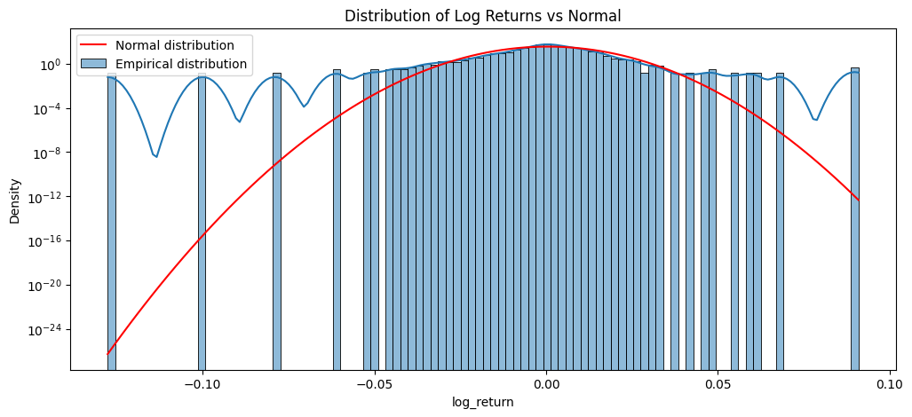
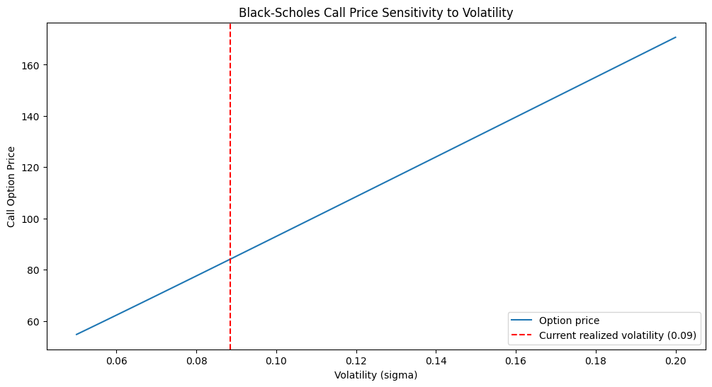
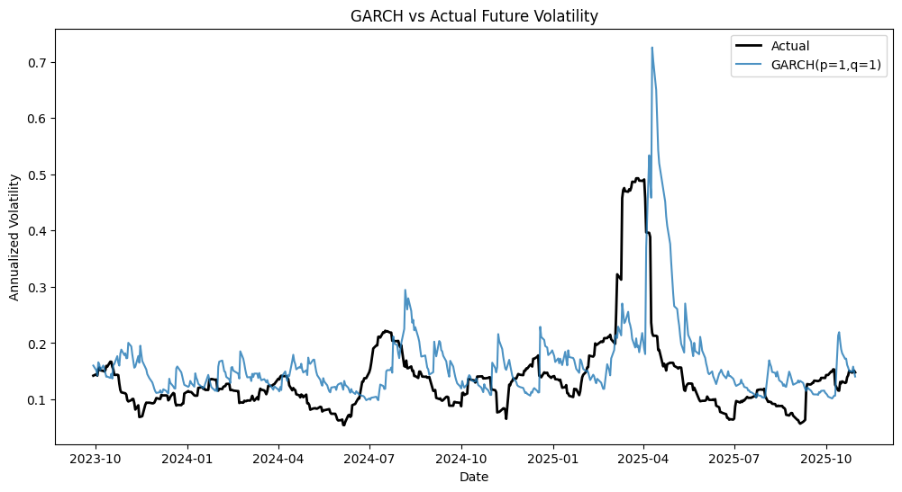

# S&P 500 Volatility Forecasting

A quantitative research project testing whether machine learning and classical econometric
models can forecast future stock market volatility better than a naive baseline — and
examining how volatility assumptions affect option pricing under the Black-Scholes model.

## Motivation

The Black-Scholes option pricing model assumes constant volatility and normally distributed
returns. Neither assumption holds in real markets. This project:

1. Empirically tests these assumptions on S&P 500 data (2015–2026)
2. Quantifies how sensitive option prices are to the volatility input
3. Builds and compares five different approaches to forecasting future volatility —
   from a naive baseline to classical econometrics (GARCH) to machine learning
   (Random Forest, XGBoost)

## Key Findings

- **Returns are not normally distributed** (Jarque-Bera test, p < 0.001) — confirming the
  well-known "fat tails" phenomenon that Black-Scholes ignores.
- **Volatility is highly persistent** (Ljung-Box test, p < 0.001) — periods of high/low
  volatility cluster together, motivating a forecasting approach.
- **Black-Scholes option prices are highly sensitive to volatility assumptions** — using
  historical vs. recent realized volatility produced a 45.7% difference in the price of the
  same option contract.
- **Simpler models generalize better**: across five forecasting models, plain Linear
  Regression outperformed Random Forest, XGBoost, and even the purpose-built GARCH(1,1)
  econometric model — all of which underperformed a naive baseline on the test period,
  most likely due to a volatility regime shift between training and test data.

## 1. Statistical Tests on Returns

| Test | Statistic | p-value | Conclusion |
|---|---|---|---|
| Jarque-Bera (normality) | 29405.91 | < 0.001 | Reject H₀ — returns are not normally distributed |
| ADF (price) | 0.8266 | 0.992 | Fail to reject H₀ — price series is non-stationary |
| ADF (log returns) | -16.9525 | < 0.001 | Reject H₀ — returns are stationary |
| Ljung-Box (squared returns) | 2982.49 | < 0.001 | Reject H₀ — volatility clustering confirmed |



*Log returns (blue) show a sharper peak and fatter tails than a normal distribution (red) —
extreme moves occur far more often than Black-Scholes assumes.*

## 2. Black-Scholes Sensitivity to Volatility

Implemented the Black-Scholes formula from scratch and priced a 30-day at-the-money call
option under two volatility assumptions:

| Volatility assumption | σ (annualized) | Call option price |
|---|---|---|
| Historical (full sample) | 0.1796 | $154.80 |
| Recent (21-day realized) | 0.0884 | $84.04 |

**A 45.7% price difference for the same contract**, depending solely on which volatility
estimate is used.



## 3. Feature Engineering

Built a feature set to predict volatility over the *next* 21 trading days, using only
information available at each point in time (no look-ahead bias):

| Feature | Correlation with future volatility |
|---|---|
| realized_volatility_5 | 0.535 |
| realized_volatility_18 | 0.505 |
| realized_volatility_21 | 0.490 |
| volume_ma_5 | 0.410 |
| return_lag_1 to lag_5 | -0.09 to -0.13 |
| day_of_week | 0.002 |

Short-term realized volatility is the strongest linear predictor — consistent with the
volatility clustering confirmed above.

## 4. Model Comparison

Five models were trained and evaluated on a chronological 80/20 train-test split
(test period: Sep 2023 – Dec 2025), with 5-fold time series cross-validation used to confirm
robustness beyond a single split.

| Model | RMSE | MAE | R² |
|---|---|---|---|
| **Linear Regression** | **0.0730** | **0.0501** | **0.0924** |
| Naive Baseline | 0.0906 | 0.0568 | — |
| GARCH(1,1) | 0.0909 | 0.0599 | -0.3590 |
| Random Forest | 0.0915 | 0.0517 | -0.4236 |
| XGBoost | 0.0951 | 0.0544 | -0.5397 |



**Linear Regression was the only model to meaningfully beat the naive baseline.** All other
models — including the industry-standard GARCH(1,1) — showed negative R² on the test period,
most likely due to a structural regime shift between the training period (2015–2023, including
the 2020 COVID shock) and the test period (2023–2025). This was confirmed via cross-validation,
not a one-off artifact of a single split.

## Why This Matters

This project deliberately avoids the common pitfall of financial ML projects: claiming high
accuracy that usually signals data leakage or an unrealistic backtest. Instead, it honestly
reports that:

- More complex models (Random Forest, XGBoost) did **not** outperform a simple linear model
- A purpose-built econometric model (GARCH) also underperformed
- Financial markets exhibit low explainable variance (R² ≈ 0.09 at best), consistent with
  their well-documented near-efficiency

## Repository Structure
```
sp500-volatility-forecasting/
├── data/
│   ├── sp500_raw.csv
│   └── sp500_features.csv
├── docs/
│   ├── fat_tails.png
│   ├── black_scholes_sensitivity.png
│   └── garch_vs_actual.png
├── notebooks/
│   ├── 01_data_and_stationarity.ipynb
│   ├── 02_black_scholes_volatility.ipynb
│   ├── 03_feature_engineering.ipynb
│   ├── 04_baseline_model.ipynb
│   ├── 05_tree_models.ipynb
│   └── 06_garch_comparison.ipynb
├── RESULTS.md
├── requirements.txt
└── README.md
```
## Tech Stack

| Tool | Purpose |
|---|---|
| pandas, numpy | Data manipulation |
| yfinance | Market data acquisition |
| scipy, statsmodels | Statistical hypothesis testing (Jarque-Bera, ADF, Ljung-Box) |
| scikit-learn | Linear Regression, Random Forest, cross-validation |
| xgboost | Gradient boosting model |
| arch | GARCH volatility modeling |
| matplotlib, seaborn | Visualization |

## How to Run

```bash
pip install -r requirements.txt
jupyter notebook
```

Run notebooks `01` through `06` in order — each builds on data/features produced by the
previous one.

## Full Results Log

Step-by-step statistical outputs and interpretations are in [`RESULTS.md`](RESULTS.md).